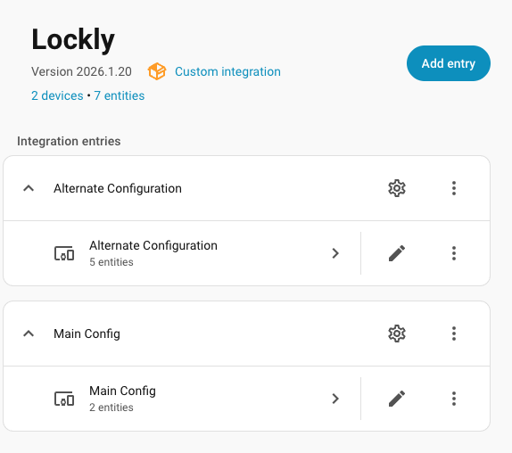
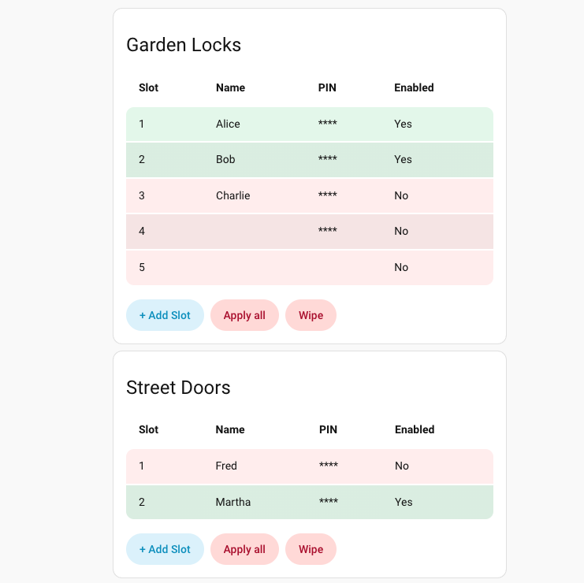
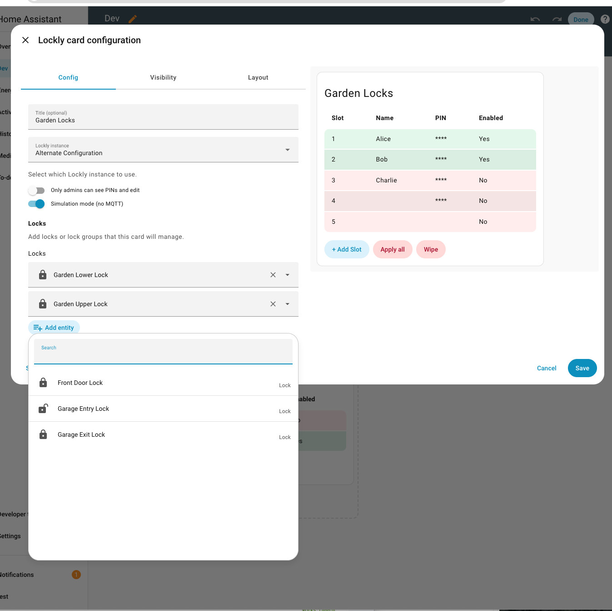
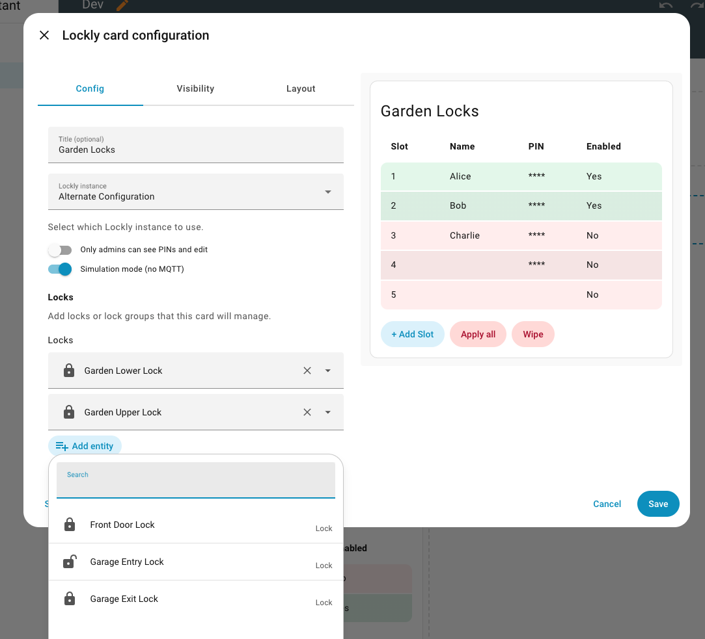
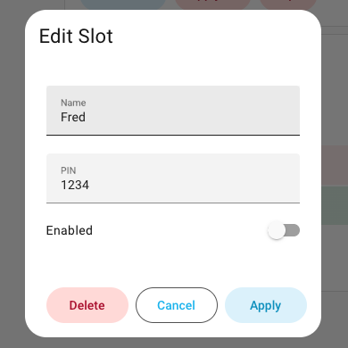
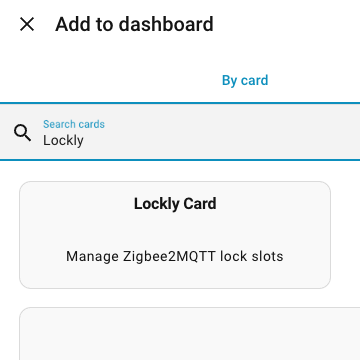

<h1 style="display: inline-flex; align-items: center; gap: 8px; margin: 0;">
  <span>Lockly</span>
  
</h1>

[](https://github.com/hacs/integration)
[](https://github.com/bharat/homeassistant-lockly/actions/workflows/validate.yml)
[](https://github.com/bharat/homeassistant-lockly/actions/workflows/lint.yml)
[](https://github.com/bharat/homeassistant-lockly/releases)

Lockly is a custom Home Assistant integration and Lovelace card that delivers a
user-friendly lock management experience for compatible Zigbee2MQTT locks. It
keeps your household access in one place with an easy, reliable, fast, and
ergonomic workflow for managing PIN slots. From quick edits to bulk updates,
Lockly stays focused on the small details that make access changes feel simple
and safe.

## Screenshots and Features

<table>
  <tr>
    <td width="40%">
      <strong>Manage multiple configurations</strong><br />
      Run separate Lockly entries for different homes, buildings, or lock groups,
      each with its own slots and MQTT settings.
    </td>
    <td width="60%">
      <a href="assets/lockly-integration-entries.png">
        
      </a>
    </td>
  </tr>
  <tr>
    <td width="40%">
      <strong>See slot status at a glance</strong><br />
      Color-coded rows show enabled vs. disabled slots plus queued/updating
      states during bulk operations.
    </td>
    <td width="60%">
      <a href="assets/lockly-card-multi.png">
        
      </a>
    </td>
  </tr>
  <tr>
    <td width="40%">
      <strong>Configure with confidence</strong><br />
      Pick the Lockly instance, control admin-only access, and enable simulation
      mode to test without sending MQTT updates.
    </td>
    <td width="60%">
      <a href="assets/lockly-card-configuration.png">
        
      </a>
    </td>
  </tr>
  <tr>
    <td width="40%">
      <strong>Select locks and groups visually</strong><br />
      Add individual locks or whole groups directly from the Lovelace editor.
    </td>
    <td width="60%">
      <a href="assets/lockly-card-entity-picker.png">
        
      </a>
    </td>
  </tr>
  <tr>
    <td width="40%">
      <strong>Fast slot edits with validation</strong><br />
      Update a slot name, PIN, or enabled state with clear, inline error
      feedback before applying changes.
    </td>
    <td width="60%">
      <a href="assets/lockly-edit-slot-dialog.png">
        
      </a>
    </td>
  </tr>
</table>

## What you can do

- Run multiple Lockly configurations side by side for different lock groups.
- Add, edit, enable, or remove lock slots on demand.
- Update slot name and PIN with inline validation and clear error feedback.
- Apply a single slot to all selected locks.
- Apply all enabled slots in one action with queued/updating progress.
- Wipe slots from locks when you need a clean slate.
- Restrict PIN visibility and edits to admins only (plus optionally grant that ability to other specified users).
- Simulate changes without sending MQTT commands.
- Choose a Lockly instance per card and preview the card live while configuring.
- Pick locks and lock groups directly from the visual editor.

## Installation (HACS)

This integration is available directly in HACS under the Integration category.

[](https://my.home-assistant.io/redirect/hacs_repository/?owner=bharat&repository=homeassistant-lockly)

1. Add this repository to HACS as a custom repository.
2. Install the integration from HACS.
3. Restart Home Assistant when prompted.

## Manual install (without HACS)

1. Copy the `custom_components/lockly` folder from this repository into your
   Home Assistant `config/custom_components/` directory.
2. Restart Home Assistant.

## Configuration

1. Go to Settings > Devices & Services and add the Lockly integration.
2. Set the maximum number of slots, MQTT base topic, and update endpoint.

## Lovelace Card

This integration ships with a bundled Lovelace card, so you can add it the
usual way from the dashboard UI.

<a href="assets/lockly-add-to-dashboard.png">
  
</a>

If you prefer YAML mode, add the card manually:

```
type: custom:lockly-card
entry_id: YOUR_ENTRY_ID
title: Lockly
lock_entities:
  - lock.front_door
  - group.downstairs_locks
admin_only: true
dry_run: true
admin_users:
  - your_user_id
```

To find the entry ID, open the Lockly integration in Settings > Devices & Services
and copy the entry ID shown in the options dialog.

In the visual editor, add the locks or lock groups that this card should manage.
Enable "Only admins can see PINs and edit" to restrict edits and PIN visibility.
Use "Additional admin users" to allow specific IDs or display names without promoting them to HA admin.
Enable "Simulation mode (no MQTT)" to test the UI without touching locks.

## How it works

- Each Lockly integration entry represents a group of slots you manage together.
- Slots are stored in Home Assistant and applied to one or more locks as needed.
- The card shows live state (queued, updating, timeout) and gives you a clear, consistent edit flow.

### Resource registration

- Storage mode (default): the integration registers the card automatically.
- YAML mode: add a resource pointing to `/lockly/lockly-card.js` (type `module`).

## Services

- `lockly.add_slot`
- `lockly.remove_slot`
- `lockly.apply_slot`
- `lockly.push_slot`
- `lockly.apply_all`
- `lockly.update_slot`
- `lockly.wipe_slots`
- `lockly.export_slots`
- `lockly.import_slots`

See `custom_components/lockly/services.yaml` for fields and descriptions.

## Export & Import

To move data between environments, export slots from one instance and import them into another:

1. In production, call `lockly.export_slots` with your `entry_id`.
2. Copy the returned JSON (the `slots` array).
3. In dev, call `lockly.import_slots` with the `entry_id` and a `payload` containing the JSON.

Use `include_pins: true` when exporting if you want PINs included. The import
will overwrite slots by default; set `replace: false` to merge instead.
